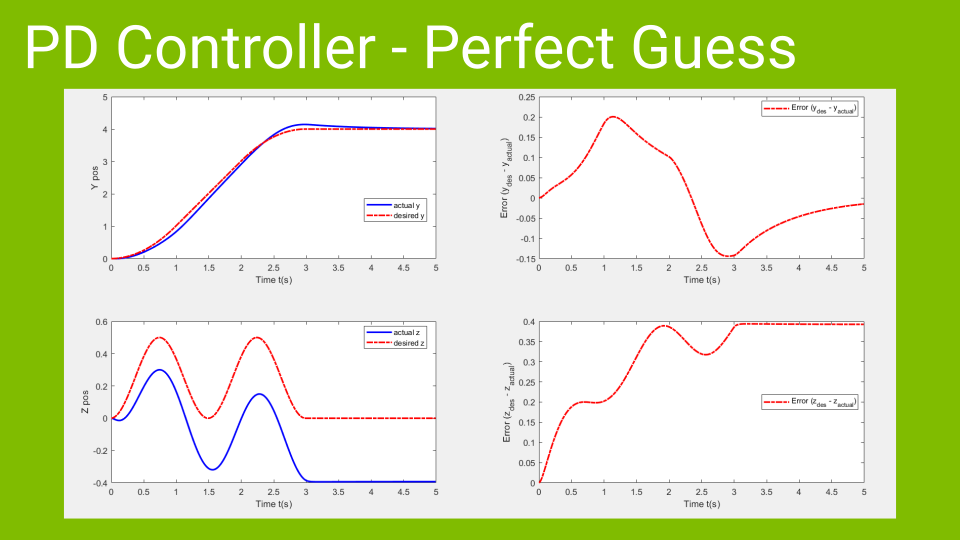
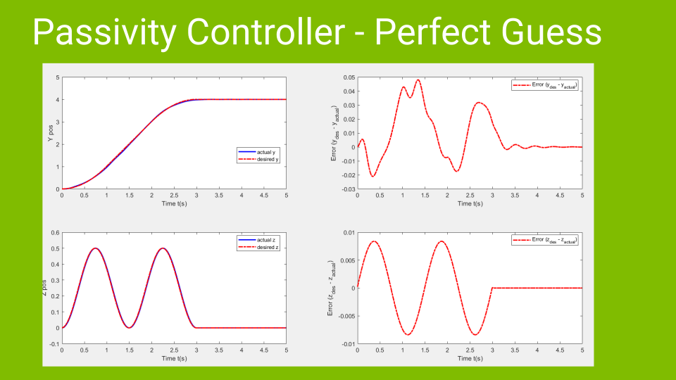

# Planar-Quadrotor-Control

References:

\(i\)  J. Escareño · S. Salazar · H. Romero · R. Lozano: Trajectory Control of a Quadrotor Subject to 2D Wind Disturbances 

\(ii\)  https://www.coursera.org/learn/robotics-flight

\(iii\)  http://underactuated.csail.mit.edu/Spring2020/

\(iv\)  B. Erginer · E. Altuğ: Modeling and PD Control of a Quadrotor VTOL Vehicle  

### If you like what I do, or you want to support me:

Bitcoin address: 
<mark>`bc1q5cjffml32qrvks3xd0hyau8jx3gf5cd04hrn77`</mark>

Litecoin address: 
<mark>`ltc1q9l4dr8jdtcakhe8qekep9lfwpgscpllxv5zy27`</mark>

Tether address: 
<mark>`0x0006a16f43D0fdf480bCc88D4398Fe73D6806fc9`</mark>
